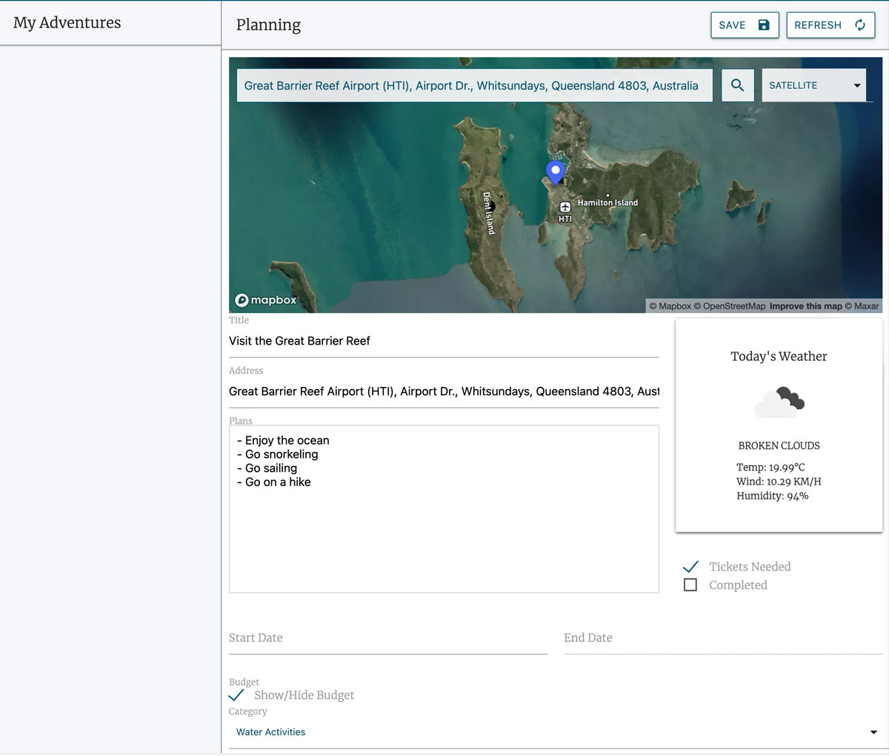
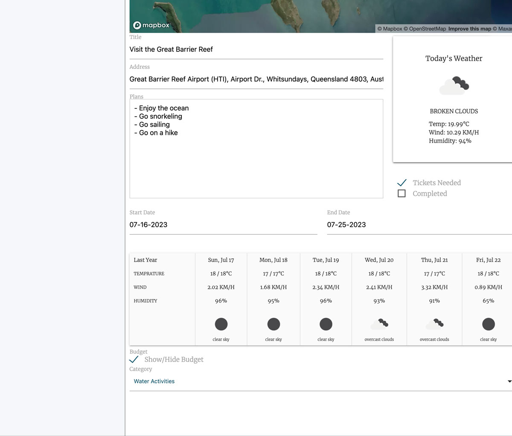

# TravelTracker 

## Overview 
TravelTracker is a web application that allows users to create and manage their travel itineraries and bucketlists. It provides features such as creating a bucket list of places to visit, planning activities on a calendar, exploring destinations on an interactive map, and checking weather information for selected locations. With TravelTracker, users can stay organized and informed while planning their dream vacations. 

## Features 
- <b>Bucket List</b>: Users can create a list of places they want to visit and track their progress. 
- <b>Calendar Functionality</b>: Users can plan activities and trips by selecting dates on a calendar and view corresponding weather information. 
- <b>Interactive Map</b>: Users can explore destinations and save locations in their bucketlists for future trip planning!
- <b>Weather Integration</b>: TravelTracker integrates with a weather API to provide users with real-time and historic weather information for their selected locations. 
- <b>Responsive Design</b>: The application is designed to be responsive, ensuring a seamless user experience across different devices. 

## Usage Guide 
- Start by creating your bucket list of places you want to visit. 
- Use the calendar functionality to plan activities by selecting desired dates and view historical weather to determine if that is a suitable time of year to visit. 
- Check the weather information for your selected locations. 
- Update and manage your itinerary as needed.

## Screenshots

## Technologies Used
- CSS
- HTML
- [DayJS](https://day.js.org/)
- [jQuery](https://jquery.com/)
- JavaScript
- [Materialize](https://materializecss.com/)
- [MapBox API](https://www.mapbox.com/)
- [Google Fonts](https://fonts.google.com/)
- [Open Weather Map API](https://openweathermap.org/)

## Live Demo
Check out the live version of this project [here](https://lightoftwelve.github.io/travel-tracker).

## Credits
This project was independently developed by the following developers with their respective contact information:

<b>Victoria Alawi</b>:
- Github: [@lightoftwelve](https://github.com/lightoftwelve)
- LinkedIn: [@Victoria Alawi](https://www.linkedin.com/in/victoria-alawi-872984250/)
- Website: [www.lightoftwelve.com](http://www.lightoftwelve.com)

<b>Manjini Abraham</b>:
- Github: [@manjiniabraham](https://github.com/ManjiniAbraham)
- LinkedIn: [@Manjini Abraham](https://www.linkedin.com/in/manjini-abraham/)

<b>Wen Ding Chen</b>:
- Github: [@landdoraine](https://github.com/Landdoraine)
- LinkedIn: [@Wen Ding Chen](https://www.linkedin.com/in/wen-ding-chen-22a9a6283/)

<b>Stanley Opare</b>:
- Github: [@stanop09](https://github.com/StanOp09)
- LinkedIn: [@Stanley Opare](https://www.linkedin.com/in/stanleyopare)

## Acknowledgements
We sincerely thank our teacher, Sean Roshan, and TA, Serena Guo, for their invaluable guidance and support during our course, as well as their help correcting FOUC concerns on our bucketlist.html file.

## License
The main license for this project is not available at this time.

---

The Materialize library used in this project is licensed under the MIT License.
Please see the [LICENSE-Materialize](LICENSE-Materialize.txt) file for more information.

